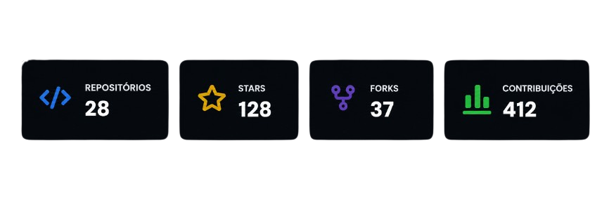

  <!-- Imagem de Banner Temporária. Substitua o link do src abaixo pela sua imagem quando criá-la no Canva -->
  

 

<!-- LINHA DE ESTATÍSTICAS E SOBRE MIM -->

  <table width="100%" border="0">
    <tr>
      <td width="50%" valign="top">
        <h3>🧠 Sobre mim</h3>
        
Apaixonado por tecnologia e por criar soluções que realmente fazem a diferença.

        
Atuo desenvolvendo aplicações escaláveis, automatizando processos e integrando sistemas que geram resultado.

        
Sempre aprendendo, sempre construindo.

        <em>“Código é lógica. Automação é liberdade.”</em>
      </td>
      <td width="50%" valign="top">
        <h3>🚀 Tecnologias</h3>
        

          
        

      </td>
    </tr>
  </table>

---

### 📈 Minhas Estatísticas

  <!-- Imagem com as estatísticas exatas geradas/editadas por você -->
  

---

### 📁 Projetos em destaque

  
  
  
  

---

  <i>Vamos construir algo incrível juntos! 🤝</i>

